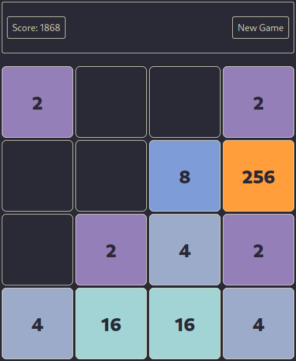
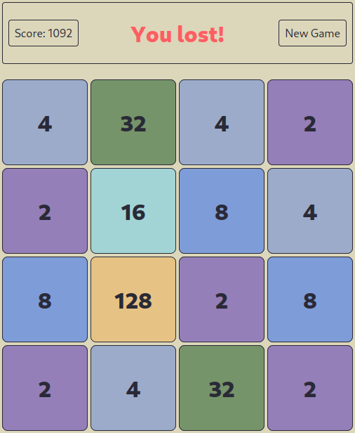
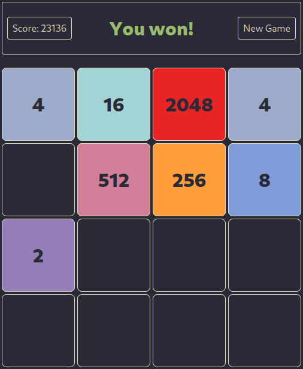

# 2048

My attempt to build the famous game _2048_ in Vanilla TypeScript.

## Installation

`npm install`

## Usage

- Start development server: `npm run dev`
- Run tests: `npm run test`
- Create production build: `npm run build`
- Serve production build: `npm run preview`

## Built with

[Vite](https://github.com/vitejs/vite/) and [TypeScript](https://github.com/microsoft/TypeScript/)

## Author

- **Pierre-Alain Castella** - _Initial work_ - [metapho-re](https://github.com/metapho-re)

## License

This project is licensed under the MIT License - see the [LICENSE](LICENSE) file for details.
